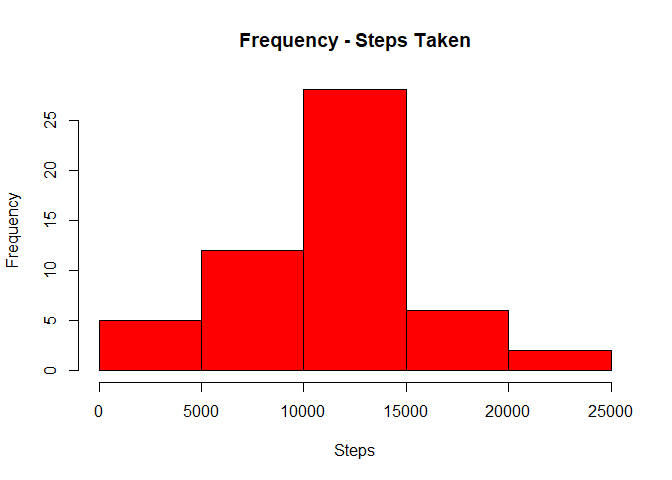
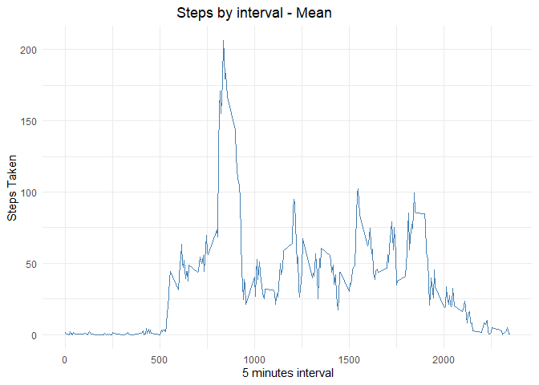
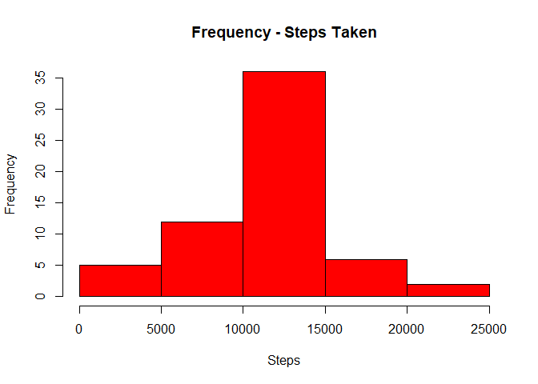
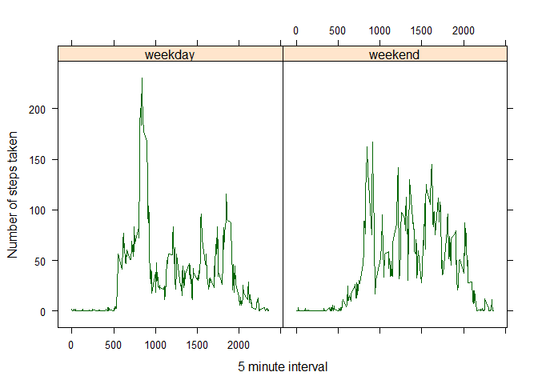

# Reproducible Research: Peer Assessment 1

##### Set Directory

``` r
getwd()
```

    ## [1] "D:/Documentos/R/Coursera/reproducible_research"

``` r
setwd("D:\\Documentos\\R\\Coursera\\reproducible_research")

library(dplyr)
```

    ## Warning: package 'dplyr' was built under R version 4.0.3

    ## 
    ## Attaching package: 'dplyr'

    ## The following objects are masked from 'package:stats':
    ## 
    ##     filter, lag

    ## The following objects are masked from 'package:base':
    ## 
    ##     intersect, setdiff, setequal, union

``` r
library(ggplot2)
library(stringr)
library(data.table)
```

    ## Warning: package 'data.table' was built under R version 4.0.3

    ## 
    ## Attaching package: 'data.table'

    ## The following objects are masked from 'package:dplyr':
    ## 
    ##     between, first, last

#### question 1 - Code for reading in the dataset and/or processing the data

``` r
activity_data <- read.csv("activity.csv", colClasses = c("numeric", "character", 
                                                         "numeric"))
#transform column date into date format
activity_data$date <- strptime(activity_data$date, format = "%Y-%m-%d")
```

##question 2 - Histogram of the total number of steps taken each day

``` r
data_1 <- activity_data %>%  
    group_by(date) %>%
    summarize(steps = sum(steps)) 
data_1 <- as.data.frame(data_1)
hist(data_1$steps, col = "red",
     main = "Frequency - Steps Taken",
     xlab = "Steps")
```



#### question 3 - Mean and median number of steps taken each day

``` r
summary(data_1)
```

    ##       date                         steps      
    ##  Min.   :2012-10-01 00:00:00   Min.   :   41  
    ##  1st Qu.:2012-10-15 18:00:00   1st Qu.: 8841  
    ##  Median :2012-10-31 12:00:00   Median :10765  
    ##  Mean   :2012-10-31 04:20:00   Mean   :10766  
    ##  3rd Qu.:2012-11-15 06:00:00   3rd Qu.:13294  
    ##  Max.   :2012-11-30 00:00:00   Max.   :21194  
    ##  NA's   :1                     NA's   :8

``` r
#So, the mean is 10766 and the median 10765
```

#### question 4 - Time series plot of the average number of steps taken

``` r
data_mean_interval <- activity_data %>%  
  group_by(interval) %>%
  summarize(steps = mean(steps, na.rm = TRUE)) 
data_mean_interval <- as.data.frame(data_mean_interval)
p <- ggplot(data_mean_interval, aes(x = interval, y = steps)) +
    geom_line(color="steelblue", size = 0.7) +
    labs(title="Steps by interval - Mean", 
         x = "5 minutes interval", y = "Steps Taken") +
    theme_minimal() +
    theme(plot.title = element_text(hjust = 0.4))
p
```



#### question 5 - The 5-minute interval that, on average, contains the maximum number of steps

``` r
row_max_steps <- which.max(data_mean_interval$steps)
data_mean_interval[row_max_steps, ]
```

    ##     interval    steps
    ## 104      835 206.1698

``` r
#The interval is the 835, with 206,17 steps in average
```

#### question 6 - Code to describe and show a strategy for imputing missing data

``` r
sum(is.na(activity_data$steps))
```

    ## [1] 2304

``` r
impute.mean <- function(x) replace(x, is.na(x), mean(x, na.rm = TRUE))
setDT(activity_data)
activity_data_no_na <- activity_data[, steps := impute.mean(steps),
                                     by = interval]
```

#### question 7 - Histogram of the total number of steps taken each day after missing values are imputed

``` r
#used the mean from intervals
activity_data_no_na <- as.data.frame(activity_data_no_na)
data_2 <- activity_data_no_na %>%  
  group_by(date) %>%
  summarize(steps = sum(steps)) 
hist(data_2$steps, col = "red",
     main = "Frequency - Steps Taken",
     xlab = "Steps")
```



``` r
summary(data_2)
```

    ##       date                         steps      
    ##  Min.   :2012-10-01 00:00:00   Min.   :   41  
    ##  1st Qu.:2012-10-15 18:00:00   1st Qu.: 9819  
    ##  Median :2012-10-31 12:00:00   Median :10766  
    ##  Mean   :2012-10-31 04:20:00   Mean   :10766  
    ##  3rd Qu.:2012-11-15 06:00:00   3rd Qu.:12811  
    ##  Max.   :2012-11-30 00:00:00   Max.   :21194  
    ##  NA's   :1

``` r
#so the mean is 10766 and median 10766; compared to the exercise done before, we got the same mean and a median 1 point above 
```

#### question 8 - Panel plot comparing the average number of steps taken per 5-minute interval across weekdays and weekends

``` r
activity_data_no_na$type_of_day <- weekdays(activity_data_no_na$date)

#transform days into factor "weekend" and "weekday", accordingly to names
activity_data_no_na$type_of_day <- as.factor(ifelse(activity_data_no_na$type_of_day %in%
                                            c("sábado", "domingo"), 
                                          "weekend", "weekday"))

#calulate mean by interval and weekend
data_mean_interval_inputed <- activity_data_no_na %>%  
  group_by(interval, type_of_day) %>% 
  summarize(steps = mean(steps, na.rm = TRUE)) 
```

    ## `summarise()` has grouped output by 'interval'. You can override using the `.groups` argument.

``` r
library(lattice)
xyplot(steps ~ interval | type_of_day, 
       data_mean_interval_inputed, 
       type = "l", 
       grid = F,
       layout = c(2, 1), 
       xlab = "5 minute interval",
       ylab = "Number of steps taken",
       col = "dark green")
```


